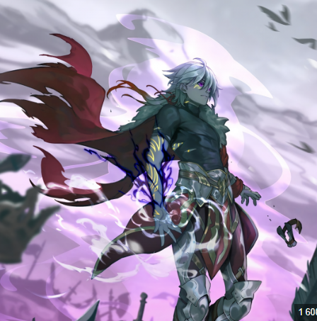

<!DOCTYPE html>
<html>
    <head>
        <meta charset="utf-8">
        
        <link rel="stylesheet" href="style.css">
        <title>Task4</title>
        <link href="https://fonts.googleapis.com/css2?family=Montserrat:wght@400;600&display=swap" rel="stylesheet">
        <link rel="stylesheet" href="assets/css/pr4.css">
        
    </head>

    <body>

        
        
        
Arthur leyvin

        <button onclick="changeColor()">Change color</button>

        
The Godkiller

        <button onclick="changeText()">Next</button>

        
    </body>

